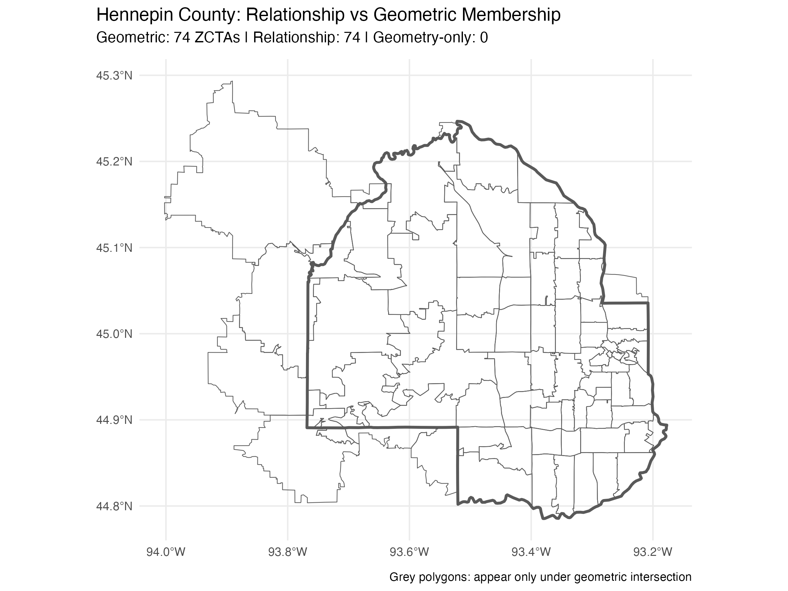

```{r setup, include = FALSE}
knitr::opts_chunk$set(
  echo = FALSE,
  message = FALSE,
  warning = FALSE,
  fig.width = 7,
  fig.height = 5,
  dpi = 300,
  fig.align = "center",
  out.width = "100%"
)
```

```{r hennepin-figures, echo=FALSE}
knitr::include_graphics("baseline_hennepin.png")

```

## Summary

These visualizations demonstrate: 1. **Baseline ZCTAs**: The 74 ZCTAs with relationship-based membership to Hennepin County 2. **Membership Discrepancy**: The 20 additional ZCTAs that appear only under geometric intersection
