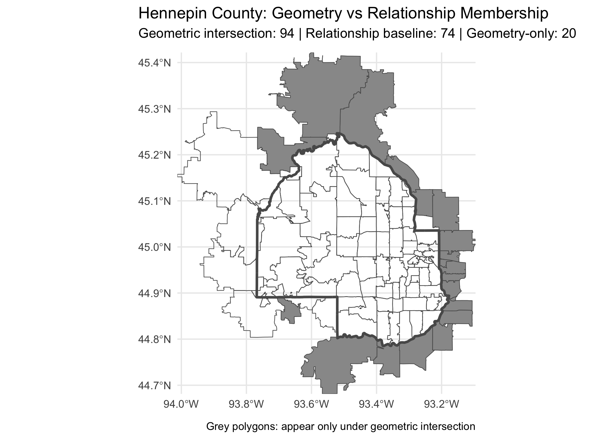

```{r setup, include = FALSE}
knitr::opts_chunk$set(
  echo    = TRUE,
  message = FALSE,
  warning = FALSE
)
```

## A Note on Variable Agnosticism

As noted in the introduction, this walkthrough uses Hennepin County and total population as a tangible case study. However, the package is designed to be **variable-agnostic** and **tool-agnostic**. The column names (e.g., `"pop"`, `"zcta"`) and geographies used here are completely interchangeable for any analysis. Every chunk below is written to be copy-paste swappable: substitute your own data path, geographic ID column, variable column, and crosswalk file.

---

## 1. Libraries

```{r libs}
library(geoDeltaAudit)
library(dplyr)
library(readr)
library(stringr)
library(janitor)
```

---

## 2. Load Baseline Data

Load your ZCTA-level tabular data. Here we use the package toy dataset for Hennepin County. Swap `system.file(...)` for your own file path.

```{r load-data}
# --- swap this path for your own data file ---
acs_path <- system.file("extdata", "toy_acs_zcta_hennepin.csv", package = "geoDeltaAudit")
stopifnot(nchar(acs_path) > 0)

acs <- readr::read_csv(acs_path, show_col_types = FALSE) |>
  janitor::clean_names() |>
  dplyr::mutate(zcta = stringr::str_pad(as.character(.data$zcta), 5, pad = "0"))
```

---

## 3. Build the Association Table (ZCTA → ZIP)

No authoritative ZCTA → ZIP crosswalk is published. We construct a 1:1 association table by treating each ZCTA as its own ZIP. In real-world use, replace this with your own crosswalk (e.g., expanded from a ZIP → ZCTA relationship file).

**Key assumption:** crosswalks are directional allocations, not inverses. This audit treats each transformation step as one-way and records perturbation and fan-out at each stage.

```{r build-assoc}
# --- swap zcta_zip_hennepin for your own association/crosswalk table ---
assoc <- acs |>
  dplyr::distinct(.data$zcta) |>
  dplyr::transmute(zcta = .data$zcta, zip = .data$zcta) |>
  dplyr::distinct()

# Structure check
assoc |>
  dplyr::summarise(
    n_rows  = dplyr::n(),
    n_zctas = dplyr::n_distinct(.data$zcta),
    n_zips  = dplyr::n_distinct(.data$zip)
  )
```

---

## 4. Association Diagnostics

Before running the audit, verify coverage and fan-out in your association table.

```{r assoc-diagnostics}
# ZCTAs in baseline data with no match in association table
unmapped <- acs |>
  dplyr::distinct(.data$zcta) |>
  dplyr::anti_join(assoc |> dplyr::distinct(.data$zcta), by = "zcta")

# How many ZIPs does each ZCTA map to?
fanout_stats <- assoc |>
  dplyr::count(.data$zcta, name = "n_zip") |>
  dplyr::summarise(
    min    = min(.data$n_zip),
    median = median(.data$n_zip),
    mean   = mean(.data$n_zip),
    max    = max(.data$n_zip)
  )

list(
  n_unmapped_zctas = nrow(unmapped),
  fanout           = fanout_stats
)
```

---

## 5. Load HUD Crosswalk (ZIP → County)

The HUD USPS ZIP–County crosswalk allocates ZIP codes to county geographies using
address-based ratios derived from quarterly USPS vacancy data. It is widely used in
applied population research because it provides national coverage and allocates at the
ZIP level. The `TOT_RATIO` field represents the proportion of total addresses within a
ZIP code associated with each county.

Note that HUD crosswalk files are directional and not invertible. The ZIP→County file
used here cannot be reversed to allocate county data back to ZIP codes — a separate
County→ZIP file exists for that direction. The audit treats this as a one-way
allocation accordingly.

For your own analysis, download the most recent quarter from:
<https://www.huduser.gov/portal/datasets/usps_crosswalk.html>

For cleaning and preparation instructions, see
`vignette("data_preparation", package = "shellgame")`.

```{r load-hud}
# --- swap this path for your own ZIP-to-county crosswalk ---
hud_path <- system.file("extdata", "toy_zip_county_hud_hennepin.csv", package = "geoDeltaAudit")
stopifnot(nchar(hud_path) > 0)

hud <- readr::read_csv(hud_path, show_col_types = FALSE)
```

---

## 6. Build and Run the Audit Pipeline

Define your transformation steps and run the audit. Swap `"zcta"` and `"pop"` for your own geographic ID column and variable column.

```{r run-audit}
# --- swap column names and step functions for your own transformation ---
steps <- list(
  step_zcta_to_zip_equal(assoc),       # Step 1: ZCTA -> ZIP (equal split)
  step_zip_to_county_totratio(hud)     # Step 2: ZIP -> County (HUD TOT_RATIO)
)

result <- audit_transform(
  data     = acs,
  geo_col  = "zcta",   # swap for your geographic ID column
  var_col  = "pop",    # swap for your variable of interest
  steps    = steps
)
```

---

## 7. Results

The table below summarizes population counts before and after the ZCTA → ZIP → County transformation using a relationship-based crosswalk and HUD proportional allocation. Net differences are attributable solely to crosswalk allocation choices, not changes in the underlying data.

| Metric                      | Value       |
|-----------------------------|-------------|
| Baseline ZCTAs              | 74          |
| Intermediate ZIPs           | 98          |
| Pre-allocation expansion    | +32.4%      |
| Baseline value              | 1,391,557   |
| Recovered value             | 1,216,874   |
| Absolute perturbation       | −174,683    |
| Percentage perturbation     | −12.6%      |

The −12.6% perturbation reflects Δx(pop): the change in the population estimate induced solely by the transformation pathway, holding the source data constant. This is not a claim about which value is "correct" — it is a quantification of pathway dependence.

---

## 8. Visualizations

The maps below show the 74 ZCTAs used in the relationship-based baseline (Decision Point 1) and the comparison between relationship-defined and geometry-defined membership. ZCTAs that appear only under geometric intersection are the source of the boundary discrepancy documented in the results above.

```{r visualizations, echo = FALSE, out.width = "100%", fig.align = "center"}
knitr::include_graphics("baseline_hennepin.png")

```

---

## What This Vignette Demonstrates

`geoDeltaAudit` separates **data values** from **geographic transformation rules**. The same source data, passed through different boundary definitions or allocation rules, produces meaningfully different estimates. This vignette makes two implicit decisions explicit:

- **Decision Point 1:** membership is defined by the Census relationship file, not geometric intersection
- **Decision Point 2:** within a ZCTA, population is split equally across associated ZIPs (not by area or housing share)

Neither decision is claimed as correct. Both are made visible and measurable.
